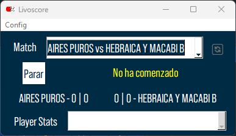
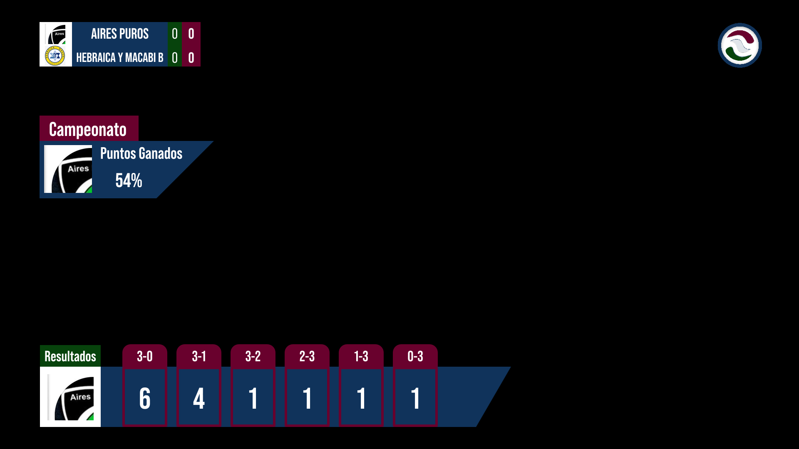
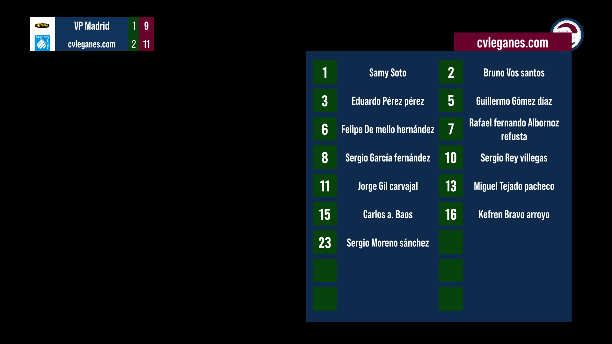
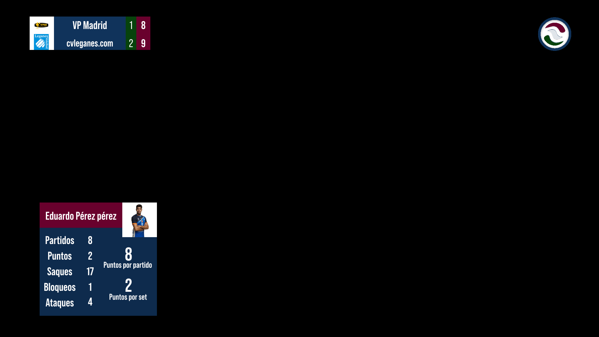
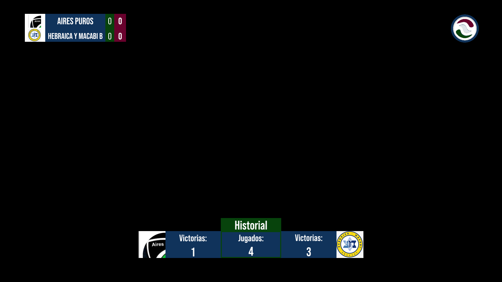
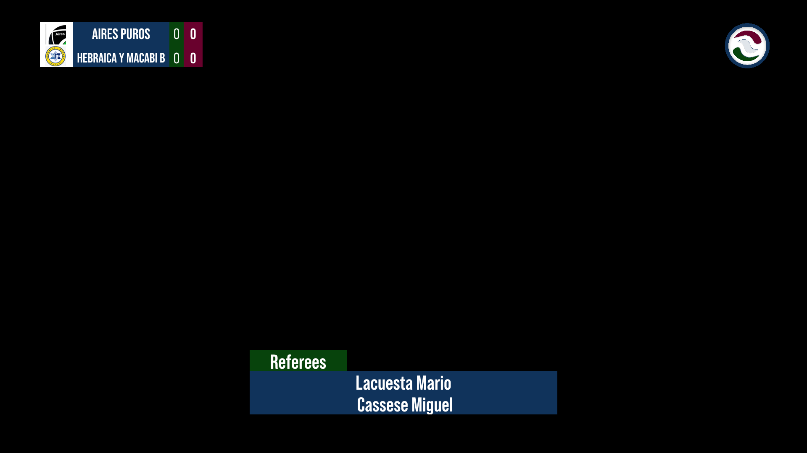

<h1 align="center">LivoScore</h1>

  

  Your right hand for volleyball streams. All graphics and stats automated.

<!-- START doctoc generated TOC please keep comment here to allow auto update -->
<!-- DON'T EDIT THIS SECTION, INSTEAD RE-RUN doctoc TO UPDATE -->

## Table of Contents

- [Introduction](#introduction)
- [Features](#features)
- [Configuration](#configuration)

<!-- END doctoc generated TOC please keep comment here to allow auto update -->

## Introduction

LivoScore provides graphics automation for volleyball matches. If you are streaming a match and its scoreboard is live on [DataProject's WCM](https://dataproject.com/Products/EU/en/Volleyball/WCM), you can automate the scoreboard and stats graphics. It is compatible with vMix and OBS.

**Disclaimer:** This version may not work with OBS. Development initially targeted OBS but transitioned to vMix, so OBS support may be limited or broken.

  

  

## Features

Here are some of the features LivoScore offers:

- Automated Scoreboard graphics
- Automated Match Statistics graphics
- Automated Championship Statistics graphics
- Automated Team Statistics graphics
- Automated Player Statistics graphics
- Automated Time Out graphics
- Automated Set and Match point graphics
- Automated Referee graphics
- Automated Player formation graphics

  

  

  

  

## Configuration

First, configure the connection to your streaming software, either OBS or vMix (note that OBS compatibility may be limited). Set the IP address (use "localhost" if LivoScore and your streaming software are on the same PC), along with the port and password for your streaming software's websocket.

  

Next, choose the league for the match you are streaming. Optionally, you can filter by team name if you only stream matches for one team.

  

Finally, configure the elements to display data, scores, and stats. This step requires knowing the names of the elements that correspond to the data you want to display.

  

